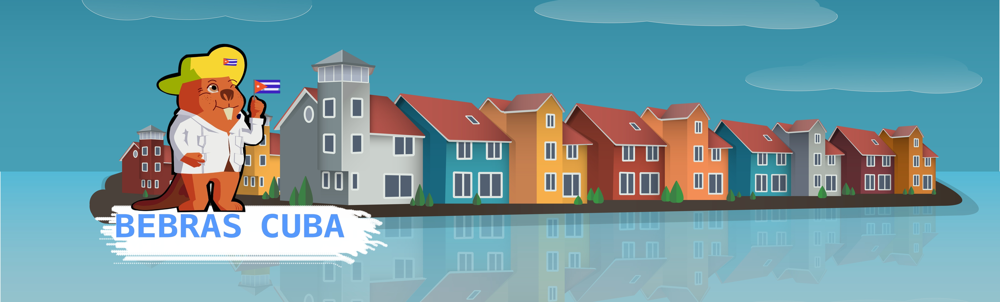

<div align="center">



# 🦫 BebrasCuba

**Plataforma de gestión y apoyo al concurso Bebras en Cuba**

[](https://laravel.com)
[](https://reactjs.org)
[](https://www.typescriptlang.org)
[](https://www.postgresql.org)

</div>

---

## 📋 Descripción

**BebrasCuba** es una aplicación web integral diseñada para gestionar y dar soporte al concurso Bebras en Cuba. La plataforma facilita la administración de participantes, coordinadores, profesores y estudiantes, permitiendo una gestión eficiente de todas las ediciones del concurso a nivel nacional, provincial y municipal.

### ✨ Características Principales

- 🎯 **Gestión Multi-nivel**: Administración desde nivel nacional hasta municipal
- 👥 **Sistema de Roles**: Múltiples roles con permisos específicos
- 📊 **GeoBebras**: Visualización geográfica de datos del concurso
- 📚 **Gestión de Recursos**: Administración de materiales y recursos educativos
- 📝 **Sistema de Solicitudes**: Gestión de solicitudes de registro y aprobaciones
- 🎓 **Gestión de Estudiantes**: Inscripción y seguimiento de participantes
- 🏫 **Gestión de Escuelas**: Administración de instituciones educativas

---

## 🛠️ Tecnologías

### Backend
- **Laravel 11** - Framework PHP moderno y robusto
- **Laravel Sanctum** - Autenticación API
- **PostgreSQL** - Base de datos relacional
- **Maatwebsite Excel** - Manejo de archivos Excel

### Frontend
- **React 18.3** - Biblioteca de UI
- **TypeScript** - Tipado estático
- **Vite** - Build tool y dev server
- **Mantine UI** - Componentes y hooks
- **React Router** - Enrutamiento
- **Axios** - Cliente HTTP
- **Recharts** - Gráficos y visualizaciones

### DevOps
- **Docker** - Contenedores
- **Docker Compose** - Orquestación

---

## 👥 Roles del Sistema

La plataforma cuenta con un sistema de roles jerárquico que permite diferentes niveles de acceso y funcionalidades:

### 🎖️ Roles Administrativos

| Rol | Descripción | Estado |
|-----|-------------|--------|
| **Administrador** | Administrador del sistema BebrasCuba con acceso completo | ✅ Activo |
| **Coordinador Nacional** | Coordinador nacional del concurso | ✅ Activo |
| **Coordinador Asistente** | Coordinador asistente del concurso | ✅ Activo |

### 🏛️ Roles Institucionales

| Rol | Descripción | Estado |
|-----|-------------|--------|
| **Representante MINED/MES** | Representantes del MINED o del MES | ✅ Activo |
| **Representante Provincial MINED** | Representante provincial del MINED | ✅ Activo |
| **Coordinador Provincial MINED** | Coordinador provincial del concurso | ✅ Activo |
| **Coordinador Municipal MINED** | Coordinador municipal del concurso | ✅ Activo |

### 👨‍🏫 Roles Educativos

| Rol | Descripción | Estado |
|-----|-------------|--------|
| **Profesor** | Profesor participante | ✅ Activo |
| **Estudiante** | Estudiante participante | ⚠️ Inactivo |

### 🎨 Roles de Contenido

| Rol | Descripción | Estado |
|-----|-------------|--------|
| **Elaborador Tareas Bebras** | Elaborador de tareas del concurso Bebras | ✅ Activo |
| **Revisor Tareas Bebras** | Revisor de tareas del concurso Bebras | ✅ Activo |

### 🤝 Roles de Colaboración

| Rol | Descripción | Estado |
|-----|-------------|--------|
| **Colaborador Bebras** | Colaborador del concurso de cualquier institución (no estudiante universitario) | ⚠️ Inactivo |
| **Colaborador Universitario Bebras** | Colaborador Bebras Estudiante Universitario (FEU) | ✅ Activo |
| **Responsable Colaborador Universitario Bebras** | Responsable de la gestión y control de Colaborador Universitario en su Universidad | ⚠️ Inactivo |

---

## 🚀 Instalación

### Prerrequisitos

- Docker y Docker Compose
- Node.js 18+ (para desarrollo local)
- PHP 8.2+ (para desarrollo local)
- Composer (para desarrollo local)

### Con Docker (Recomendado)

```bash
# Clonar el repositorio
git clone https://github.com/rusergio/bebrascuba.git
cd bebrascuba

# Iniciar los contenedores
docker-compose up -d

# Instalar dependencias del backend
docker-compose exec backend composer install

# Ejecutar migraciones
docker-compose exec backend php artisan migrate

# Ejecutar seeders
docker-compose exec backend php artisan db:seed

# Instalar dependencias del frontend
cd frontend
npm install

# Iniciar servidor de desarrollo
npm run dev
```

### Desarrollo Local

#### Backend

```bash
cd backend

# Instalar dependencias
composer install

# Configurar .env
cp .env.example .env
php artisan key:generate

# Configurar base de datos en .env
# DB_CONNECTION=pgsql
# DB_HOST=127.0.0.1
# DB_PORT=5432
# DB_DATABASE=bebras_cuba
# DB_USERNAME=postgres
# DB_PASSWORD=tu_password

# Ejecutar migraciones
php artisan migrate

# Ejecutar seeders
php artisan db:seed

# Iniciar servidor
php artisan serve
```

#### Frontend

```bash
cd frontend

# Instalar dependencias
npm install

# Iniciar servidor de desarrollo
npm run dev

# Build para producción
npm run build
```

---

## 📁 Estructura del Proyecto

```
bebrascuba/
├── backend/                 # API Laravel
│   ├── app/
│   │   ├── Http/
│   │   │   └── Controllers/ # Controladores
│   │   └── Models/          # Modelos Eloquent
│   ├── database/
│   │   ├── migrations/       # Migraciones
│   │   └── seeders/         # Seeders
│   └── routes/
│       └── api.php          # Rutas API
│
├── frontend/                # Aplicación React
│   ├── src/
│   │   ├── components/      # Componentes React
│   │   ├── pages/           # Páginas
│   │   ├── router/          # Configuración de rutas
│   │   ├── context/         # Context API
│   │   ├── styles/          # Estilos CSS
│   │   └── assets/          # Imágenes y recursos
│   └── package.json
│
└── docker-compose.yml       # Configuración Docker
```

---

## 🔑 Funcionalidades por Rol

### 👨‍💼 Administrador
- Gestión completa del sistema
- Registrar nuevos usuarios
- Ver usuarios registrados
- Administrar concurso

### 🌐 Coordinador Nacional
- Gestionar concurso (ediciones, recursos, solicitudes)
- Visualización GeoBebras
- Administración a nivel nacional

### 🏛️ Coordinador Provincial
- Gestionar municipios
- Ver solicitudes provinciales
- Visualización GeoBebras
- Gestión de escuelas provinciales

### 🏘️ Coordinador Municipal
- Gestionar escuelas
- Ver solicitudes municipales
- Visualización GeoBebras
- Gestión de profesores municipales

### 👨‍🏫 Profesor
- Gestionar alumnos
- Inscribir estudiantes
- Ver recursos educativos
- Visualización GeoBebras

---

## 📝 API Documentation

La documentación de la API está disponible en el archivo `GUIA_PRUEBA_POSTMAN.md` que incluye ejemplos de endpoints y pruebas con Postman.

---

## 🤝 Contribuir

Las contribuciones son bienvenidas. Por favor:

1. Fork el proyecto
2. Crea una rama para tu feature (`git checkout -b feature/AmazingFeature`)
3. Commit tus cambios (`git commit -m 'Add some AmazingFeature'`)
4. Push a la rama (`git push origin feature/AmazingFeature`)
5. Abre un Pull Request

---

## 📄 Licencia

Este proyecto está bajo la Licencia MIT.

---

## 👨‍💻 Autores

- **Rusergio** - [GitHub](https://github.com/rusergio)

---

## 🙏 Agradecimientos

- Equipo Bebras Internacional
- Comunidad educativa cubana
- Todos los colaboradores del proyecto

---

<div align="center">

**Hecho con ❤️ para el Concurso Bebras Cuba**

🦫 ¡Promoviendo el pensamiento computacional en Cuba!

</div>
